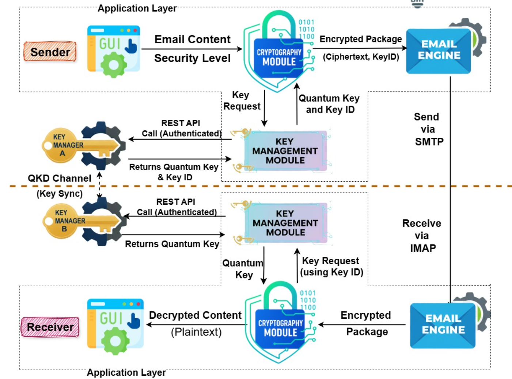

# ⚛️ Quantum-Encrypted Email System

[](LICENSE)
[](https://www.python.org/)
[](https://sih.gov.in/)

A comprehensive email encryption system utilizing **Quantum Key Distribution (QKD)** and multiple security levels for secure communication.

> 🚀 **Fast Track:** Want to jump right in? Click here to read our **[QUICKSTART.md](QUICKSTART.md)** guide!

---

## 🏗️ System Architecture



The system follows a dual-SAE architecture based on the **ETSI GS QKD 014** standard:

| Component | Role | Details |
|-----------|------|---------|
| **SAE-1 (Key Manager A)** | Encryption | Requests `enc_keys` from KME-1 on both sender & receiver machines |
| **SAE-2 (Key Manager B)** | Decryption | Retrieves `dec_keys` from KME-2 on both sender & receiver machines |
| **QKD Channel** | Key Sync | Synchronises quantum keys between KME-1 and KME-2 |
| **Cryptography Module** | Encrypt/Decrypt | Supports 4 security levels (XOR → Hybrid) |
| **Email Engine** | Transport | Sends via SMTP, receives via IMAP (Gmail API) |

---

## 🔭 Overview

This system implements a quantum-enhanced email encryption platform designed to secure sensitive communications against future threats.

- **Quantum Key Distribution (QKD)** ⚛️ using BB84 protocol simulation
- **4 Security Levels** 🛡️ for different security/performance trade-offs
- **Key Management** 🔑 with REST API
- **Email Engine Integration** 📧 with Gmail
- **GUI Application** 🖥️ for user-friendly operation

## ✨ Features

### 🔐 Security Levels

1.  **Level 1: Basic (XOR with Quantum Key)** ⚡
    * **Algorithm:** One-Time Pad with XOR
    * **Speed:** Fastest
    * **Use case:** Low-latency, high-volume communications
    * **Security:** Information-theoretically secure (OTP)

2.  **Level 2: Standard (AES-256-GCM)** 🔒
    * **Algorithm:** AES-256-GCM with quantum key
    * **Speed:** Fast
    * **Use case:** General secure communications
    * **Security:** Industry-standard authenticated encryption

3.  **Level 3: High (ChaCha20-Poly1305)** 🛡️
    * **Algorithm:** ChaCha20-Poly1305 with key mixing
    * **Speed:** Moderate
    * **Use case:** High-security communications
    * **Security:** Enhanced security with quantum key mixing

4.  **Level 4: Maximum (Hybrid)** ☢️
    * **Algorithm:** RSA-2048 + AES-256-GCM + Quantum Key
    * **Speed:** Slowest
    * **Use case:** Top-secret requirements
    * **Security:** Post-quantum resistance preparation

### ⚛️ Quantum Key Distribution (QKD)

-   **BB84 Protool Simulation:** Basis reconciliation & QBER estimation
-   **Privacy Amplification:** SHA-256 for key compression
-   **Eavesdropping Detection:** Alerts if error rates exceed thresholds

### 🔑 Key Management

-   **Lifecycle:** Creation, storage, expiration
-   **One-Time Use:** Strict enforcement (OTP principle)
-   **REST API:** Remote key operations

### 🔄 Dual-SAE Architecture

-   **SAE-1 (Encryption):** Both machines use SAE-1 identity with KME-1 to request `enc_keys`
-   **SAE-2 (Decryption):** Both machines use SAE-2 identity with KME-2 to retrieve `dec_keys`
-   **Symmetric Design:** No role-based restrictions — any machine can send and receive

## 📂 Project Structure

```text
Quant_Crypt_SIH/
├── src/
│   ├── qkd/                  # ⚛️ BB84 QKD implementation
│   ├── key_management/       # 🔑 Key lifecycle & API
│   ├── cryptography/         # 🛡️ 4-level encryption engine
│   ├── email_engine/         # 📧 Gmail integration
│   ├── GUI/                  # 🖥️ Tkinter User Interface
│   └── Qukaydee_setup/       # 🔧 SAE certificates & QKD config
│       ├── alice_sender/     # SAE-1 certs (encryption)
│       ├── bob_receiver/     # SAE-2 certs (decryption)
│       └── certs/            # Root CA certificate
├── Email_client_ui/          # 🌐 Web-based email client
├── bridge.py                 # 🌉 REST API bridge (Flask)
├── examples/                 # 📚 Usage scripts
├── QUICKSTART.md             # 🚀 Quick start guide
├── System_Architecture.png   # 🏗️ Architecture diagram
└── README.md                 # 📖 Documentation
```
